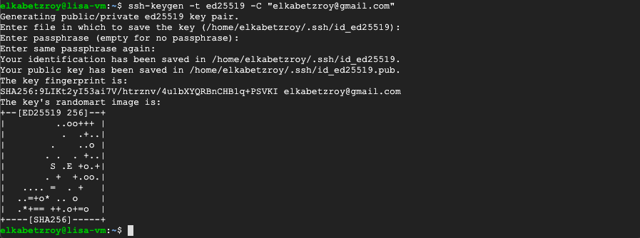

## Clone a Github Repository to a GCP VM Instance
**Date: October 2021**

First we showed check if Git is already installed on our instance by running the next command 

```
dpkg -s git
```

If Git is not installed we install it by running

```
sudo apt install git
```

The next few steps was partially referenced from [here](https://docs.github.com/en/authentication/connecting-to-github-with-ssh/generating-a-new-ssh-key-and-adding-it-to-the-ssh-agent).

To generate a new SSH key run the next command

```
ssh-keygen -t ed25519 -C "your_email@example.com"
```
when the key is generated you should see the next line in terminal

```
Generating public/private algorithm key pair.
```

then, you will be asked to choose a folder to save the key, just press enter. When you asked to enter passwords also press enter. Finally, you should see something like this



Now lets add the new ssh key to our ssh-agent, we do that by first initiating the ssh-agent with the next command

```
eval "$(ssh-agent -s)"
```

next add the ssh key to the ssh-agent

```
ssh-add ~/.ssh/id_ed25519
```

Run the next command to print the ssh public key to the clipboard 

```
cat ~/.ssh/id_ed25519.pub
```

and copy the whole displayed line in the terminal. In your Github account select your user and then go to the next **Settings** --> **SSH and GPG keys** and select the **New SSH key** green button. Paste the copied key from terminal and give a short title. Now you can clone whatever repository you want from your git account to your GCP VM. Do this by going to the repository you want to clone in your Github account and under **Code** --> **Clone** select ssh and copy the URL address below. Then, go back to the VM terminal and create a folder to your git projects by typing

```
mkdir GitProjects
```

enter that directory with 

```
cd GitProjects
```

and clone the repository by running git clone with the copied address

```
git clone <copied-repository-ssh-address>
```
and now you have your repository in the GitProjects folder.


