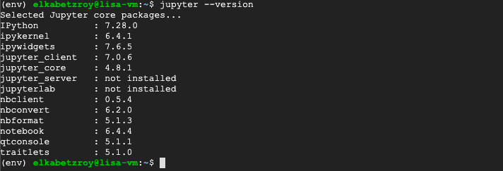
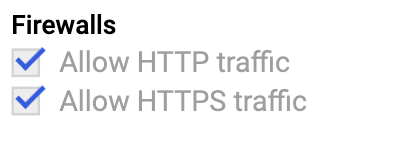
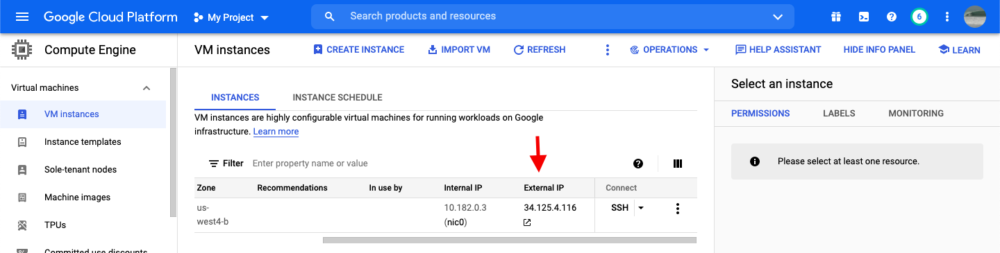

## Initiate Jupyter Notebook on a GCP VM Instance
**Date: October 2021**

In this section I referenced some steps from [here](https://www.datacamp.com/community/tutorials/google-cloud-data-science). 

1. Install Jupyter onto a GCP VM instance with a virtual environment
2. Configure the VM to allow communication with Jupyter
3. Configure Jupyter and setting up a password
4. Add the virtual environment to Jupyter interpreters list

As a first step we need to activate our virtual environment with 

```
source <your-venv-name>/bin/activate
```
When its active you should verify you have the latest pip version by running

```
pip install --upgrade pip
```

Now, having an **activated** venv with the latest pip version we can begin.

### Install Jupyter onto a GCP VM instance with a virtual environment

To install the Jupyter package you should run

```
pip install jupyter
```

you can check the installed version by typing in the terminal

```
jupyter --version
```
If everything went well you should see something like this



### Configure the VM to allow communication with Jupyter

In order to allow the VM to work with Jupyter-notebook we need to enable **HTTP, HTTPS** traffic and to write a new Firewall rule. To see how to create from scratch a VM instance with HTTP and HTTPS traffic allowed, see the [Create a GCP VM Instance](Create_a_GCP_VM_Instance.md) explanation. In case you already have a working VM instance which you would like to reconfigure, follow the next few steps.

- In your GCP account go to **Compute Engine** --> **VM instances** and click on the name of your VM. Then, verify that 'Allow HTTP traffic' and 'Allow HTTPS traffic' are marked. If they are not marked, click on **EDIT** in the top of the page and mark them both.

 

- Next, open the navigation menu on the top left and scroll down to **VPC network** --> **Firewall**. Select **CREATE FIREWALL RULE** in the top. Give a name to your rule and scroll down to **Targets**, in the drop down select **All instances in the network**.
- In **Source IP ranges** write the next IP address: 0.0.0.0/0.
- Under **Protocols and Ports** mark **tcp** and type in 8888.

It should look like this


Finally,  press **CREATE** to create the rule.

### Configure Jupyter and setting up a password
Jupyter notebooks come with a configuration file that needs to be generated and edited in order to setup online access to your notebooks. To create a Jupyter configuration file run

```
jupyter notebook --generate-config
``` 
Then, pick a strong password for online connection by running

```
jupyter notebook password
```

Next, we need to change the default ip configuration of Jupyter-notebook from 'localhost' to any ip. First, open the configuration file in a **nano** text editor by running

```
nano .jupyter/jupyter_notebook_config.py
```
>_you can use what ever editor is available._

then you could scroll down to the commented ```# c.NotebookApp.ip = 'localhost'``` command, uncomment it, and switch `'localhost'` with `'*'` (means: listening to any ip). Another way could be by just adding the next command somewhere in the file (the top for example)

```
c.NotebookApp.ip = '*'
```
after writing the last command just save and exit from the file.
>_In nano this can be done by pressing `ctrl + x` and hitting `y` to save._

This will allow the notebook to be available for all IP addresses on your VM and not just `http://localhost:8888`.

You are now ready to lunch notebook, just run

```
jupyter-notebook --no-browser --port=8888
```
If Jupyter-notebook is successfully activated, you should see something like this in the terminal


In order to open the notebook on the browser go to GCP and copy your VM external IP address



Then, open in the browser the next URL:`http://<your-VM-external-IP>:8888/`, a Jupyter password window should open up. Fill in the you password from earlier and log in.

### Add the virtual environment to Jupyter interpreters list
In order to add a virtual environment to Jupyter we need to first create one and activate it (see file [Install Python on a Linux GCP VM Instance](Install_Python_on_a_Linux_GCP_VM_Instance.md)). When activating it you should see the name of your virtual environment added in parenthesis (<name_of_venv>) before your username in the terminal. We need to manually add the virtual environment kernel if we want to have it in the Jupyter Notebook by running the next line 

```
python -m ipykernel install --user --name=<name-of-your-venv>
```
so we have set up our virtual environment kernel and it is ready to be used in the Jupyter Notebook.

You can verify that it is been added by open the Jupyter-notebook in the browser as we saw earlier, and click on **New** on the top right of the screen. You should see your virtual environment name in the pop-up window 


