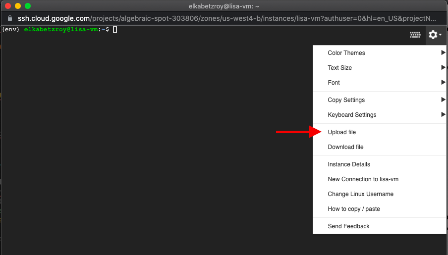

## Install Gym and Atari libraries (with ROMs) on a GCP VM Instance 

**Date: October 2021**


In this short guide we will see:

1. How to install the openAI Gym python library on a virtual environment
2. Install the `atari_py` python library
3. Download and install Atari Roms
4. Running a DQN script of an Atari Pong game

Before we start we need to create a virtual machine, download python, create a python virtual environment, clone the DQN git repository from Github and install its requirements.txt file.
The information to all of these steps can be found in:

- [Create a GCP VM Instance](Create_a_GCP_VM_Instance.md)
- [Install Python on a Linux GCP VM Instance](Install_Python_on_a_Linux_GCP_VM_Instance.md)
- [Clone a Github Repository to a GCP VM Instance](Clone_a_Github_Repository_to_a_GCP_VM_Instance.md)


### How to install the openAI Gym python library on a virtual environment

In case we already created a virtual environment we can activate it now with the next command 

```source <path-to-venv-directory>/bin/activate```

then to install the **gym** library just run 

```pip install gym```


### Install the *atari_py* python library

Just run

```pip install atari-py```


### Download and install Atari Roms

Next, we need to download and install the Atari Roms in order to run ```gym.make("some-atari-game-name")```. In general we can download the `Roms.rar` file from the [Atarimania](http://www.atarimania.com/rom_collection_archive_atari_2600_roms.html) website directly into our virtual machine (vm) with _wget_ by running the next command in the terminal

```wget http://www.atarimania.com/roms/Roms.rar```

the problem is that this `.rar` file cannot be extracted with free rar linux suftwares like **unrar** or **rar**. My lazy solution is to download the `Roms.rar` into your local machine (home computer) and extract it locally. You should see the next two files inside

- `HC ROMS.zip`
- `ROMS.zip`

Then, upload those two files into your vm using the **Upload file** option



After uploading both files you should see them in the main folder by running `ls` in the main directory. Next, make a new directory named **Roms** in the main directory with ```mkdir Roms``` and move the two files into that directory with 

```mv <file_name> Roms```

Having the two files in the `Roms` directory we now activate the virtual environment (if it is not active already) and from the main directory we run the next command

```python -m atari_py.import_roms Roms```

The last command should extract all the atari roms and install them in the atari_py package directory. 

Now, in principle we are done, but it is common when working with the gym and atari_py libraries to use the **cv2** python package. The **cv2** package needs some linux packages in order to run properly with gym so before start working you should install some linux packages by running the next command in terminal

```apt-get install ffmpeg libsm6 libxext6  -y```

which installs the `ffmpeg`, `libsm6` and `libxext6` packages. Now we are finaly ready.

### Running a DQN script of an Atari Pong game


To run a DQN reinforcement learning experiment on an Atari environment you can clone some DQN repository from Github (there are plenty) using the next command

```git clone <SSH-clone-path-from-github-repository>```

in case you do not have git installed you can install it with 

```sudo apt-get install git```

and then run the ```git clone``` command. Specifically, you can use the next DQN repository

```git clone git@github.com:RoyElkabetz/DQN_with_PyTorch_and_Gym.git```

then install the requirements.txt file with venv (see [Install Python on a Linux GCP VM Instance](Install_Python_on_a_Linux_GCP_VM_Instance.md)) and follow the API from the [repository](https://github.com/RoyElkabetz/DQN_with_PyTorch_and_Gym) to run an experiment. A quick 10 games experiment just for checkup can be run by `cd` to the DQN directory, and inside that directory run the next command in terminal

```python main.py -n_games 10 -algo 'DuelingDDQNAgent' -train True```