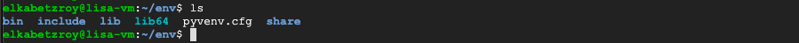
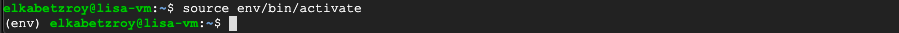

## Install Python on a Linux GCP VM Instance
**Date: October 2021**

This part was referenced from [here](https://cloud.google.com/python/docs/setup#linux). In this section we will see how to do the next things:
  
1. Update Linux's Advanced Packaging Tool (APT)
2. Install python3
3. Manually install wget package for Linux
4. Manually install latest python pip version  
5. Create a local python virtual environment for a specific project 
6. Install some packages to virtual environment project

Before going through this section, please open your instance SSH terminal (see [Create a GCP VM Instance](Create_a_GCP_VM_Instance.md)). Following the ordered list above, we first would like to update the Linux instance apt (do not count on GCP to initiate your instance with the most updated version, although it might be the case)

### 1. Update Linux's Advanced Packaging Tool (APT)
To update apt run the next command in the terminal

```
sudo apt update
```

### 2. Install python3
Next, let us install python3 by running

```
sudo apt install python3
```

>_notice: this command will install the latest python version indexed in apt which usually won't be the latest python version available. In order to install the latest python version you should download it to your instance using wget and then install it manually._ 

install some python3 dev tools

```
sudo apt install python3-dev
```

>_when asked: Do you want to continue? [Y/n]  
>type: Y_

install the python3 virtual environment package

```
sudo apt install python3-venv
```

### 3. Manually install wget package for Linux
Next, in order to install manually the latest pip package we need to use Linux's **wget** command which is not automatically installed, so let us install it by running

```
sudo apt install wget
```

### 4. Manually install latest python pip version 
Downloading a script to get latest **pip** version

```
wget https://bootstrap.pypa.io/get-pip.py
```

by running ```ls``` you should see ```get-pip.py``` printed to the command line. _get-pip.py_ is a python script that collect and install the latest **pip** version (more info can be found in [here](https://github.com/pypa/get-pip)). To run it just run the next line in terminal

```
sudo python3 get-pip.py
```
>_notice: you can ignore a warning about running ```get-pip.py``` as root. We intentionally run it with root using ```sudo``` in order to update the VM instance system package._

You can verify that the **pip** installation went well by checking its version running

```
pip --version
```

you should see something similar to this


### 5. Create a local python virtual environment for a specific project

To create a python3 virtual environment we should run the next command 

```
python3 -m venv /path/to/new/virtual/environment
```

For example, the command
```
python3 -m venv env
```
will create a new directory called ```env``` (if not already exist) inside the current directory and will initiate a new virtual environment in that new directory (more info in [venv docs](https://docs.python.org/3/library/venv.html)). If everything went ok, listing the content inside the target directory (```env``` in the example) you should see something similar to this



To activate the virtual environment one should run the next command **outside** the ```env``` directory

```
source env/bin/activate
```

or the next **inside** the ```env``` directory 

```
source bin/activate
```

if the virtual environment is active you should see ```<(name-of-your-target-folder)>``` in front of the command line header, similar to that



First thing after you activate your new virtual environment you should upgrade pip by running

```
pip install --upgrade pip
```
>_it turns out that even if the latest pip version is installed on your VM, a new virtual environment would be initialized with the newest pip version in the linux package index, which is probably not the latest. You can check the pip version in the linux index with ```sudo apt show versions python3-pip```. To save yourself some troubles in the future, first thing when activating your newly venv, upgrade pip !!!_


To deactivate the virtual environment justs run

```
deactivate
```

### 6. Install some packages to virtual environment project

In order to install some packages to the virtual environment we created we first need to activate it (see command above). Next we can use the well known ```pip install <name-of-package>``` to install a specific package. When done, deactivate the virtual environment.


