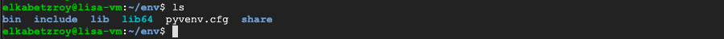
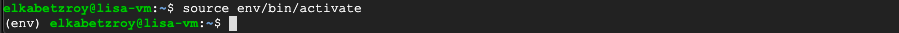
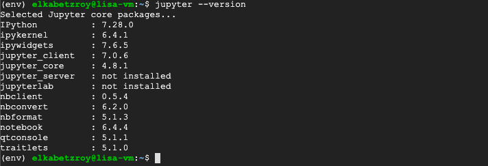
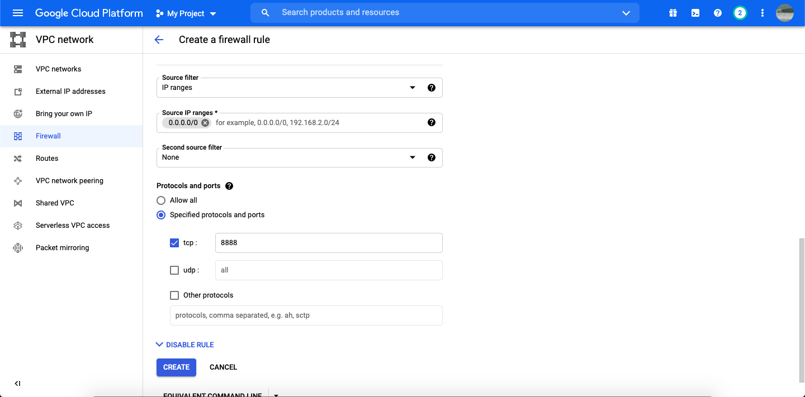
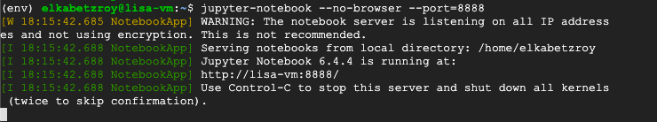
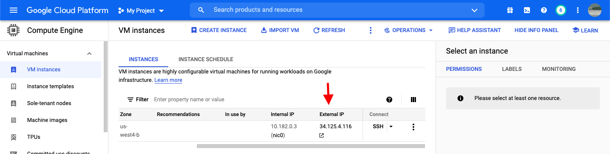
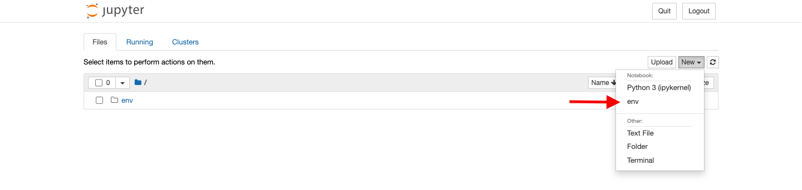

## Create a GCP VM Instance
**Date: October 2021**

After initiate a [Google Cloud Platform](https://cloud.google.com/) account we open the _navigation menu_ on the top left.


Next, scroll down and hover over the _Compute Engine_ tab which will open a second indented menu where we should select the _VM instance_ tab.


It should looks like this (but without the _lisa-vm_ instance)


Now, let us create a simple instance with a single GPU. For that, select **CREATE INSTANCE**, the next window should appear


First, choose a name for your instance. Next, pick a _Region_ and a _Zone_. On the top right, under **Monthly estimate**, you can see the estimated cost for an instance in the chosen region and zone. For a detailed price calculation, down select **DETAILS**. Each region has a different price, with the cheapest one being the _us-central1_ (true for October 2021). You should know that different regions offer different services. For our purpose, the _us-central1_ region with any zone (i.e. _us-central1-c_) would do just fine. 

Next, under **Machine configuration** --> **Series** we choose the wanted CPU platform. In order to later being able to add a GPU to our instance, we need to choose a CPU platform that supports a GPU, so we choose the **N1** (**notice: a _Free-tier_ account does not support GPUs**). Under **Machine type** we can choose the amount of CPU cores and RAM from the discrete dropdown menu or create our own combination by choosing _custom_. An instance with 2 CPU cores and 7.5 GB RAM would be enough for general purpose _Machine Learning_ simulations. Notice that by changing the **Machine type** parameters, the estimated price also change. 

Next, in order to add a GPU we need to open the **CPU PLATFORM AND GPU**


such that we see the next window


If the **+ ADD GPU** tab is coloured blue we can push it in order to add a GPU to our instance. If the tab is coloured grey it means that the CPU platform or the region we chose does not supports GPUs and we need to select one that does. 
 
Selecting the **+ ADD GPU** tab the next window will open


Here, we can choose the _type_ and _number_ of GPUs we would like to add to our instance. Both of these parameters would be reflected in the estimated price.

Next, under **Boot disk** we select the operating system, which I will leave as Debian GNU (Linux), and the disk size.


In order to later enable internet traffic to our instance we need to allow both **HTTP** and **HTTPS** traffic options. In the next sections we will see how to add some Firewall rules to enable _Jupyter-notebook_ workspace.


Finally, we select **CREATE** to initiate the VM instance, which would take us to the next page


The green circle under **STATUS** means our instance is currently running. A running instance cost money, to stop the instance, click the three vertical dots on the right and select **Stop**. If the instance is running we can start working with it with an SSH by pushing the SSH tag under **Connect**, the next window should pop up. Your instance is ready for work.


## Install Python on a Linux GCP VM Instance

This part was referenced from [here](https://cloud.google.com/python/docs/setup#linux). In this section we will see how to do the next things:
  
1. Update Linux's Advanced Packaging Tool (APT)
2. Install python3
3. Manually install wget package for Linux
4. Manually install latest python pip version  
5. Create a local python virtual environment for a specific project 
6. Install some packages to virtual environment project

Before going through this section, please open your instance SSH terminal (see last section). Following the ordered list above, we first would like to update the Linux instance apt (do not count on GCP to initiate your instance with the most updated version, although it might be the case)

### 1. Update Linux's Advanced Packaging Tool (APT)
To update apt run the next command in the terminal

```
sudo apt update
```

### 2. Install python3
Next, let us install python3 by running

```
sudo apt install python3
```

>_notice: this command will install the latest python version indexed in apt which usually won't be the latest python version available. In order to install the latest python version you should download it to your instance using wget and then install it manually._ 

install some python3 dev tools

```
sudo apt install python3-dev
```

>_when asked: Do you want to continue? [Y/n]  
>type: Y_

install the python3 virtual environment package

```
sudo apt install python3-venv
```

### 3. Manually install wget package for Linux
Next, in order to install manually the latest pip package we need to use Linux's **wget** command which is not automatically installed, so let us install it by running

```
sudo apt install wget
```

### 4. Manually install latest python pip version 
Downloading a script to get latest **pip** version

```
wget https://bootstrap.pypa.io/get-pip.py
```

by running ```ls``` you should see ```get-pip.py``` printed to the command line. _get-pip.py_ is a python script that collect and install the latest **pip** version (more info can be found in [here](https://github.com/pypa/get-pip)). To run it just run the next line in terminal

```
sudo python3 get-pip.py
```
>_notice: you can ignore a warning about running ```get-pip.py``` as root. We intentionally run it with root using ```sudo``` in order to update the VM instance system package._

You can verify that the **pip** installation went well by checking its version running

```
pip --version
```

you should see something similar to this


### 5. Create a local python virtual environment for a specific project

To create a python3 virtual environment we should run the next command 

```
python3 -m venv /path/to/new/virtual/environment
```

For example, the command
```
python3 -m venv env
```
will create a new directory called ```env``` (if not already exist) inside the current directory and will initiate a new virtual environment in that new directory (more info in [venv docs](https://docs.python.org/3/library/venv.html)). If everything went ok, listing the content inside the target directory (```env``` in the example) you should see something similar to this



To activate the virtual environment one should run the next command **outside** the ```env``` directory

```
source env/bin/activate
```

or the next **inside** the ```env``` directory 

```
source bin/activate
```

if the virtual environment is active you should see ```<(name-of-your-target-folder)>``` in front of the command line header, similar to that



First thing after you activate your new virtual environment you should upgrade pip by running

```
pip install --upgrade pip
```
>_it turns out that even if the latest pip version is installed on your VM, a new virtual environment would be initialized with the newest pip version in the linux package index, which is probably not the latest. You can check the pip version in the linux index with ```sudo apt show versions python3-pip```. To save yourself some troubles in the future, first thing when activating your newly venv, upgrade pip !!!_


To deactivate the virtual environment justs run

```
deactivate
```

### 6. Install some packages to virtual environment project

In order to install some packages to the virtual environment we created we first need to activate it (see command above). Next we can use the well known ```pip install <name-of-package>``` to install a specific package. When done, deactivate the virtual environment.


## Initiate Jupyter Notebook on a GCP VM Instance

In this section I referenced some steps from [here](https://www.datacamp.com/community/tutorials/google-cloud-data-science). 

1. Install Jupyter onto a GCP VM instance with a virtual environment
2. Configure the VM to allow communication with Jupyter
3. Configure Jupyter and setting up a password
4. Add the virtual environment to Jupyter interpreters list

As a first step we need to activate our virtual environment with 

```
source <your-venv-name>/bin/activate
```
When its active you should verify you have the latest pip version by running

```
pip install --upgrade pip
```

Now, having an **activated** venv with the latest pip version we can begin.

### Install Jupyter onto a GCP VM instance with a virtual environment

To install the Jupyter package you should run

```
pip install jupyter
```

you can check the installed version by typing in the terminal

```
jupyter --version
```
If everything went well you should see something like this



### Configure the VM to allow communication with Jupyter

In order to allow the VM to work with Jupyter-notebook we need to enable **HTTP, HTTPS** traffic and to write a new Firewall rule. To see how to create from scratch a VM instance with HTTP and HTTPS traffic allowed, see the **Create a GCP VM Instance** section above. In case you already have a working VM instance which you would like to reconfigure, follow the next few steps.

- In your GCP account go to **Compute Engine** --> **VM instances** and click on the name of your VM. Then, verify that 'Allow HTTP traffic' and 'Allow HTTPS traffic' are marked. If they are not marked, click on **EDIT** in the top of the page and mark them both.

 

- Next, open the navigation menu on the top left and scroll down to **VPC network** --> **Firewall**. Select **CREATE FIREWALL RULE** in the top. Give a name to your rule and scroll down to **Targets**, in the drop down select **All instances in the network**.
- In **Source IP ranges** write the next IP address: 0.0.0.0/0.
- Under **Protocols and Ports** mark **tcp** and type in 8888.

It should look like this



Finally,  press **CREATE** to create the rule.

### Configure Jupyter and setting up a password
Jupyter notebooks come with a configuration file that needs to be generated and edited in order to setup online access to your notebooks. To create a Jupyter configuration file run

```
jupyter notebook --generate-config
``` 
Then, pick a strong password for online connection by running

```
jupyter notebook password
```

Next, we need to change the default ip configuration of Jupyter-notebook from 'localhost' to any ip. First, open the configuration file in a **nano** text editor by running

```
nano .jupyter/jupyter_notebook_config.py
```
>_you can use what ever editor is available._

then you could scroll down to the commented ```# c.NotebookApp.ip = 'localhost'``` command, uncomment it, and switch `'localhost'` with `'*'` (means: listening to any ip). Another way could be by just adding the next command somewhere in the file (the top for example)

```
c.NotebookApp.ip = '*'
```
after writing the last command just save and exit from the file.
>_In nano this can be done by pressing `ctrl + x` and hitting `y` to save._

This will allow the notebook to be available for all IP addresses on your VM and not just `http://localhost:8888`.

You are now ready to lunch notebook, just run

```
jupyter-notebook --no-browser --port=8888
```
If Jupyter-notebook is successfully activated, you should see something like this in the terminal



In order to open the notebook on the browser go to GCP and copy your VM external IP address



Then, open in the browser the next URL:`http://<your-VM-external-IP>:8888/`, a Jupyter password window should open up. Fill in the you password from earlier and log in.

### Add the virtual environment to Jupyter interpreters list
In order to add a virtual environment to Jupyter we need to first create one and activate it (see file **Install Python on a Linux GCP VM Instance**). When activating it you should see the name of your virtual environment added in parenthesis (<name_of_venv>) before your username in the terminal. We need to manually add the virtual environment kernel if we want to have it in the Jupyter Notebook by running the next line 

```
python -m ipykernel install --user --name=<name-of-your-venv>
```
so we have set up our virtual environment kernel and it is ready to be used in the Jupyter Notebook.

You can verify that it is been added by open the Jupyter-notebook in the browser as we saw earlier, and click on **New** on the top right of the screen. You should see your virtual environment name in the pop-up window 




## Clone a Github Repository to a GCP VM Instance

## Install Gym with Atari libraries (with ROMs) on a GCP VM Instance 


