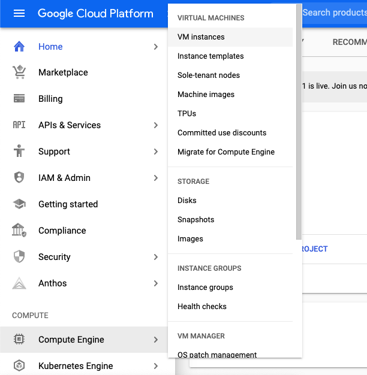

## Create a GCP VM Instance
**Date: October 2021**

After initiate a [Google Cloud Platform](https://cloud.google.com/) account we open the _navigation menu_ on the top left.


Next, scroll down and hover over the _Compute Engine_ tab which will open a second indented menu where we should select the _VM instance_ tab.



It should looks like this (but without the _lisa-vm_ instance)


Now, let us create a simple instance with a single GPU. For that, select **CREATE INSTANCE**, the next window should appear


First, choose a name for your instance. Next, pick a _Region_ and a _Zone_. On the top right, under **Monthly estimate**, you can see the estimated cost for an instance in the chosen region and zone. For a detailed price calculation, down select **DETAILS**. Each region has a different price, with the cheapest one being the _us-central1_ (true for October 2021). You should know that different regions offer different services. For our purpose, the _us-central1_ region with any zone (i.e. _us-central1-c_) would do just fine. 

Next, under **Machine configuration** --> **Series** we choose the wanted CPU platform. In order to later being able to add a GPU to our instance, we need to choose a CPU platform that supports a GPU, so we choose the **N1** (**notice: a _Free-tier_ account does not support GPUs**). Under **Machine type** we can choose the amount of CPU cores and RAM from the discrete dropdown menu or create our own combination by choosing _custom_. An instance with 2 CPU cores and 7.5 GB RAM would be enough for general purpose _Machine Learning_ simulations. Notice that by changing the **Machine type** parameters, the estimated price also change. 

Next, in order to add a GPU we need to open the **CPU PLATFORM AND GPU**


such that we see the next window


If the **+ ADD GPU** tab is coloured blue we can push it in order to add a GPU to our instance. If the tab is coloured grey it means that the CPU platform or the region we chose does not supports GPUs and we need to select one that does. 
 
Selecting the **+ ADD GPU** tab the next window will open


Here, we can choose the _type_ and _number_ of GPUs we would like to add to our instance. Both of these parameters would be reflected in the estimated price.

Next, under **Boot disk** we select the operating system, which I will leave as Debian GNU (Linux), and the disk size.


In order to later enable internet traffic to our instance we need to allow both **HTTP** and **HTTPS** traffic options. In the next sections we will see how to add some Firewall rules to enable _Jupyter-notebook_ workspace.


Finally, we select **CREATE** to initiate the VM instance, which would take us to the next page


The green circle under **STATUS** means our instance is currently running. A running instance cost money, to stop the instance, click the three vertical dots on the right and select **Stop**. If the instance is running we can start working with it with an SSH by pushing the SSH tag under **Connect**, the next window should pop up. Your instance is ready for work.


## Install Python to Linux VM Instance

This part was referenced from [here](https://cloud.google.com/python/docs/setup#linux). In this section we will see how to do the next things:
  
1. Update Linux's Advanced Packaging Tool (APT)
2. Install python3
3. Manually install wget package for Linux
4. Manually install latest python pip version  
5. Create a local python virtual environment for a specific project 
6. Install some packages to our project
7. Install a python editor

Before going through this section, please open your instance SSH terminal (see last section). Following the ordered list above, we first would like to update the Linux instance apt (do not count on GCP to initiate your instance with the most updated version, although it might be the case)

#### Update Linux's Advanced Packaging Tool (APT)
To update apt run the next command in the terminal

```
sudo apt update
```

#### Install python3
Next, let us install python3 by running

```
sudo apt install python3
```

>_notice: this command will install the latest python version indexed in apt which usually won't be the latest python version available. In order to install the latest python version you should download it to your instance using wget and then install it manually._ 

install some python3 dev tools

```
sudo apt install python3-dev
```

>_when asked: Do you want to continue? [Y/n]  
>type: Y_

install the python3 virtual environment package

```
sudo apt install python3-venv
```

#### Manually install wget package for Linux
Next, in order to install manually the latest pip package we need to use Linux's **wget** command which is not automatically installed, so let us install it by running

```
sudo apt install wget
```

#### Manually install latest python pip version 
Downloading a script to get latest **pip** version

```
wget https://bootstrap.pypa.io/get-pip.py
```

by running ```ls``` you should see ```get-pip.py``` printed to the command line. _get-pip.py_ is a python script that collect and install the latest **pip** version (more info can be found in [here](https://github.com/pypa/get-pip)). To run it just run the next line in terminal

```
sudo python3 get-pip.py
```
>_notice: you can ignore a warning about running ```get-pip.py``` as root. We intentionally run it with root using ```sudo``` in order to update the VM instance system package._

You can verify that the **pip** installation went well by checking its version running

```
pip --version
```

you should see something similar to this


#### Create a local python virtual environment for a specific project


## Clone a Github Repository

## Initiate Jupyter Notebook in VM

## Install Gym with Atari libraries 


