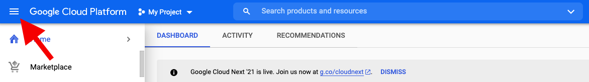

## Create a GCP VM Instance
After initiate a [Google Cloud Platform](https://cloud.google.com/) account we open the _navigation menu_ on the top left.

Next, scroll down and hover over the _Compute Engine_ tab which will open a second indented menu where we should choose the _VM instance_ tab.

It should looks like this (just without the _lisa-vm_ instance)

Now, let us create a simple instance with a single GPU, for that, pick **CREATE INSTANCE**. The next window will appear

## Install Python to VM Instance

## Clone a Github Repository

## Initiate Jupyter Notebook in VM

## Install Gym with Atari libraries 

